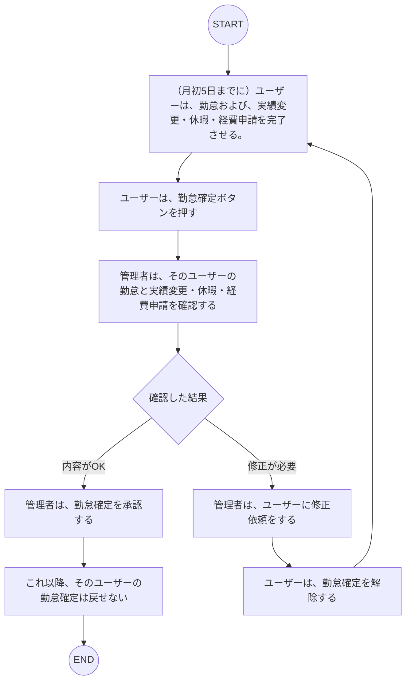

## 勤怠確定のフロー

```mermaid
graph TD
  X((START)) --> A
  A[（月初5日までに）ユーザーは、勤怠および、実績変更・休暇・経費申請を完了させる。] --> B[ユーザーは、勤怠確定ボタンを押す]
  B --> C[管理者は、そのユーザーの勤怠と実績変更・休暇・経費申請を確認する]
  C --> D{確認した結果}
  D --> |内容がOK| E[管理者は、勤怠確定を承認する]
  D --> |修正が必要| O[管理者は、ユーザーに修正依頼をする]
  O --> Q[ユーザーは、勤怠確定を解除する]
  Q --> A
  E --> F[これ以降、そのユーザーの勤怠確定は戻せない]
  F --> G((END))
```
