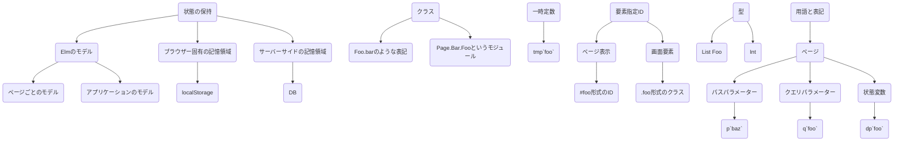

# フロントエンドの設計書について

## 状態の保持について

本アプリケーションでは、用途に応じて適切な記憶領域に状態を保持している。
例えば以下のような方針で記憶領域を選択している。

* Elmのモデル
    * ページごとのモデル: ページ遷移で消えてもいい情報
    * アプリケーション（`Main.elm`）のモデル: ページリロードで消えてもいい情報
* ブラウザー固有の記憶領域
    * localStorage: 別のブラウザーで開いたときに同期しなくても不具合がない情報
* サーバーサイドの記憶領域
    * DB: 恒久化したい情報

実際にはどの記憶領域を採用しているかというlow levelな情報を隠蔽するためにフロントエンド側で専用のモジュールを用意することが多い。
モジュールのAPIについては`npm run doc`で確認できる。

## クラス

仕様書内では、クラス`Foo`が持つメソッド`bar`を単に`Foo.bar`と表記する。
Elmコードにおいてはこのクラスをモジュールによって実現することを想定している。
つまり、もし上記の例が `Bar` というページに関する記述である場合、`bar`をexposeする`Page.Bar.Foo`というモジュールを作成して実現する。

具体的なクラスの説明とそのメソッドについてはドキュメントサーバーを起動して確認すること。

## 一時定数

処理の流れなどにおいて、定数に対して説明をわかりやすくするための仮名をつけることがある。
慣習として、`foo`という名前の仮名を _tmp`foo`_ と表記することが多い。

## 要素指定ID（ページ表示）

「ページ表示」の「表示要素」において、特定の「画面要素」に`#foo`という形式のIDを付与することがある。
これはHTMLのIDとは**別の概念**で、単にドキュメント内で「どの要素に関するイベントか」を明確にするために用いられる。

「処理の流れ」において`#foo`のような記載に遭遇した場合、当該ページ表示の「表示要素」を参照すること。

## 要素指定ID（画面要素）

「画面要素」の「表示要素」において、特定の要素に`.foo`という形式のクラスを付与することがある。
これはHTMLのクラスとは**別の概念**で、単にドキュメント内で「どの要素に関するイベントか」を明確にするために用いられる。

実際に「処理の流れ」において使われる場合は、ページ表示の要素指定IDをともなって`#foo.bar`のような形式で記載される。
これは当該「ページ表示」における「表示要素」で`#foo`を付与されている「画面要素」の「表示要素」のうち、`.bar`を付与されている要素のことを意味する。

## 型

値の型は `` `}` で挟んでElmの表記にしたが。
たとえばある値がクラス`Foo`のインスタンスのリストである場合、`{List Foo}`と表記する。
独自定義したクラス名以外にも、Elm組み込みの型を使って `{Int}` などと表記することもある。

## 用語と表記

### ページ

1つのURLに対応した状態のこと。
1つのURLおよび、複数の「パスパラメーター」「クエリパラメーター」「状態変数」「ページ表示」からなる。

#### パスパラメーター

URLのパス部分に埋め込まれたパラメーター。
URLを`/foo/bar/:baz/`と表記したとき、":baz"の部分がパスパラメーターであることを意味し、その部分に埋め込んだ値を _p`baz`_ と表記する。

#### クエリーパラメーター

URLのクエリー部分に指定されたパラメーター。
クエリー部分が`?foo=32&bar=baz`のとき、 _q`foo`_ と表記することで`foo`に指定した`32`の値を意味する。

#### 状態変数

ページの状態に関する情報。
`foo`という名前の状態変数を _dp`foo`_ と表記する。

TEPAによる実装では各`Page`モジュールにおいてMemory値で管理される値。

「処理の流れ」によって値が更新される。

### ページ表示

「ページ」がとりうる表示状態の1つを意味する。
複数の「パラメーター」および「画面要素」からなる。
`foo`という名前のページ表示を _(foo)_ と表記する。
「ページ」の状態変数を直接、参照・更新することができる。

#### パラメーター

ページ表示の挙動や見た目に関する情報のうち、アプリケーションの状態として管理する必要がないもの。
TEPAの文脈で言えば、Memoryで管理する必要がないもの。

たとえば「処理の流れ」において、クエリーパラメーターやlocalStorageなどから取得する値はMemoryに入れずに直接ページ表示の関数に引数として渡せばいい。そういうものを「パラメーター」とする。

"foo"という名前のパラメーターは _a`foo`_ と表記する。

### 画面要素

画面を構成する要素のこと。
「パラメーター」「状態変数」「表示要素」からなる。
"foo"という名前の画面要素は _{foo}_ と表記する。
「ページ」の状態変数を直接操作できない。
「ページ」の状態変数を参照のみしたい場合は「パラメーター」にその状態変数の値を渡す。
「ページ」の状態変数を参照・更新したい場合は「状態変数」にその状態変数を紐付ける。

#### パラメーター

画面表示の挙動や見た目に関する情報のうち、アプリケーションの状態として管理する必要がないもの。
TEPAの文脈で言えば、Memoryで管理する必要がないもの。

たとえば「処理の流れ」において、クエリーパラメーターやlocalStorageなどから取得する値はMemoryに入れずに直接ページ表示の関数に引数として渡し、ページ表示からさらにバケツリレーで画面表示に渡せせばいい。そういうものを「パラメーター」とする。

"foo"という名前のパラメーターは _a`foo`_ と表記する。

#### 状態変数

画面表示の状態に関する情報。
画面表示の状態変数はページ表示の状態変数の一部がバケツリレーで渡される。

"foo"という名前の状態変数は _d`foo`_ と表記する。

「状態 *変数* 」と呼ぶが、画面表示から直接状態を書き換えることはできず、必ず「処理の流れ」がページの状態変数を変更することで、結果としてバケツリレーでこの値も変更される。

#### 表示要素

画面要素を構成する要素。

### 処理の流れ

ページ読み込みからの一連の処理の流れ。

#### パラメーター

読み込み専用の設定値。
"foo"という名前のパラメーターは _a`foo`_ と表記する。

#### 状態変数

ページの状態変数（ _dp`foo`_ 形式であらわされるもの）の中で、特定の「処理の流れ」に特別に関連するもの。

"foo"という名前のパラメーターは _d`foo`_ と表記する。

例えば、あるページにおいて投稿データが _dp`page.posts`_ として与えられていたとする。このとき各投稿データに関する処理を記述するには、以下のように記述することができる。

```markdown
* _dp`page.posts`_ の各要素 _tmp`post`_ に対して、非同期で並行して以下の処理を行う
    * 「各投稿に関する流れ」へ
        * _d`post`_: _tmp`post`_
```

なお、ページの状態変数自体を処理の流れの中で直接書き換えることもできる。


上記のマニュアルに従って、下記の対応をしたいです。
返信ボタン（矢印）を押したときに、footerの投稿フォームを閉じるようにする
おそらく、下記の部分が変更必要なのですが、どこを変えればいいでしょうか？


#### _{投稿フィールド}_

##### パラメーター

* _a`post`_ `{Post}`
* _a`localCommentCount`_ `{Int}`: 返信内容を送信したときに、返信先投稿のコメント数に反映するためのもの
    * `localCommentCount`を用意せずに直接返信先投稿の`.post.commentCount`を変更することで対象のコメント数を更新すると、最新投稿読み込み時のコメント数更新処理でコメント数が重複して加算されてしまう
    * ただし、 https://github.com/uzuz-inc/winter-morning/issues/398 の問題により、現在は最新投稿読み込み時に `.post.commentCount` を更新することはしない実装にしている
* _a`likeForm`_ `{Object}`
    * where `Object`: _{いいねフォーム}_ のパラメーター
* _a`newCommentForm`_ `{Object}`
    * where `Object`: _{返信フォーム}_ のパラメーター
* _a`showNewCommentForm`_ `{Bool}`
* _a`showSupporterDetail`_ `{Bool}`
* _a`emphasizeReplyButton`_ `{Bool}`

##### 初期値

* _a`post`_: 初期値なし
* _a`localCommentCount`_ `0`
* _a`newCommentForm`_: _{返信フォーム}_ の初期値
* _a`likeForm`_: _{いいねフォーム}_ の初期値
* _a`showNewCommentForm`_: `False`
* _a`showSupporterDetail`_: `False`
* _a`emphasizeReplyButton`_ 初期値なし（_(投稿一覧)_から渡す）

##### 表示要素（一覧ページ用）

URLフラグメント値が _a`post.postId`_ と等しい場合、全体の背景にハイライト色を付ける。

* テキスト
    * ラベル: `投稿ID: ${postId}`
        * `${postId}`: _a`post.postId`_
* サポーター情報
    * _a`post.supporter`_ が`Nothing`でない場合のみ
        * アイコン画像
            * src: _a`post.supporter.iconUri`_
        * サポーター名テキスト: _a`post.supporter.name`_
        * 公式バッジ画像
            * src: 公認サポーターであることを表現するもの
                * _a`post.supporter.rank`_ に応じて表示しわける
            * title: 「この投稿はキャリエモン公認サポーターによるものです」
        * _a`showSupporterDetail`_ が`True`の場合のみ
            * 自己PRテキスト:
                * _{マークアップ}_
                    * _a`flags`_: _dp`flags`_ の値
                    * _a`content`_: _a`post.supporter.selfIntroduction`_
* 相談希望者情報
    * _a`post.worker`_ が`Nothing`でない場合のみ
        * ID
            * 迷惑ユーザーの場合:
                ```
                迷惑ユーザー ${hash}
                ```
                * `${hash}`: _a`post.worker.hash`_
            * その他ユーザーの場合:
                ```
                一般ユーザー ${hash}
                ```
                * `${hash}`: _a`post.worker.hash`_
* 記事リンク(投稿日時):
    * ラベル: _a`post.posted`_
    * id: _a`post.postId`_
    * href: `/c/text-consultation/posts#${postId}`
        * `${postId}`: _a`post.postId`_
* _a`post.parent`_ が `Nothing` （つまり新規投稿）の場合のみ:
    * 投稿カテゴリー ラベル: `${category}`
        * `${category}`: `TopicCategory.toLabel` の結果
            * arg1: _a`post.topicCategory`_
    * _a`post.worker.?education`_ が `Nothing` でない場合のみ:
        * 最終学歴: `${year}年${month}月に${schoolType}を${status}`
            * where `${year}`: _a`post.worker.education.year`_
            * where `${month}`: _a`post.worker.education.month`_
            * where `${schoolType}`: _a`post.worker.education.schoolType`_
            * where `${status}`: _a`post.worker.education.status`_
    * _a`post.worker.?education`_ が `Nothing` でない場合のみ:
        * 学部: _a`post.worker.education.faculty`_
    * _a`post.worker?.age`_ または _a`post.worker?.gender`_ の少なくとも1つが `Nothing` でない場合のみ:
        * 年齢:
            * _a`post.worker.age`_ が `Nothing` の場合: `未回答`
            * それ以外:
                * `${ageCore}歳`
                    * where `${ageCore}`: _a`post.worker.age`_
        * 性別:
            * _a`post.worker.gender`_ が `Nothing` の場合: `未回答`
            * それ以外:
                * `App.Profile.genderLabel` の結果
                    * arg1: _a`post.worker.gender`_
* 投稿内容:
    * _{投稿本文}_
        * _a`flags`_: _dp`flags`_ の値
        * _a`profile`_: _dp`profile`_ の値
        * _a`post`_: _a`post`_
* 個別相談の案内:
    * 表示条件: 以下の条件をすべて満たす
        * _a`post.supporter?.privateConsultationSuggestion`_ が`Nothing`ではない
    * 表示内容:
        * _{個別相談の案内}_
            * _a`content`_: _a`post.supporter?.privateConsultationSuggestion`_
* _{返信件数ボタン}_
    * _a`postId`_:  _a`post.postId`_
    * _a`ancestor`_:  _a`post.ancestorId`_
    * _a`commentCount`_: _a`post.commentCount`_ + _a`localCommentCount`_
    * _a`enableAnimation`_: _a`localCommentCount`_ が1以上のとき`True`
        * これによって、新規返信時にのみ件数の変更を分かりやすくアニメーション表示することができる
* 矢印のアイコン `.showCommentFormButton`
  * _a`emphasizeReplyButton`_ `{Bool}`
    * これが`True`のときに矢印アイコンに色をつける(`<クラス名>-emphasize`クラスを追加する)
    * これによって、自分の投稿への返信に対しての返信ボタンが分かりやすくなり、お礼等の行動がスムーズに行える
* _{いいねフォーム}_
    * パラメーター: _a`likeForm`_
* _{いいね回数表示欄}_
    * パラメーター: _a`likeForm`_
* _{返信フォーム}_
    * _a`showCommentForm`_ が`True`の場合のみ
    * パラメーター: _a`newCommentForm`_


#### _{フッター}_

##### パラメーター

* _a`openForm`_ `{Bool}`: _{投稿フォーム}_ を開いているかどうか
* _a`newTopicForm`_ `{Object}`
    * where `Object`: _{投稿フォーム}_ のパラメーター

##### 表示要素

* ヘッダー `.header`
    * テキスト: "新しい相談を投稿する"
    * アイコンボタン: 押せる感じのやつ
        * _a`openNewTopicForm`_ が `True` のとき、下に閉じられそうな感じのアイコン
        * _a`openNewTopicForm`_ が `False` のとき、上に開けそうな感じのアイコン
* ボディ
    * _a`openForm`_ が `True` のときだけ以下の要素を表示する
        * _{投稿フォーム}_
            * パラメーター: _a`newTopicForm`_


