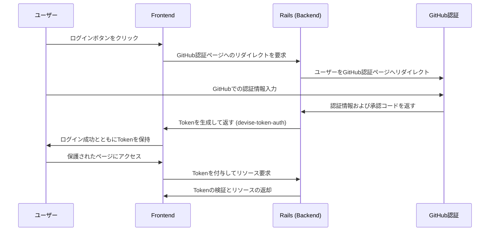
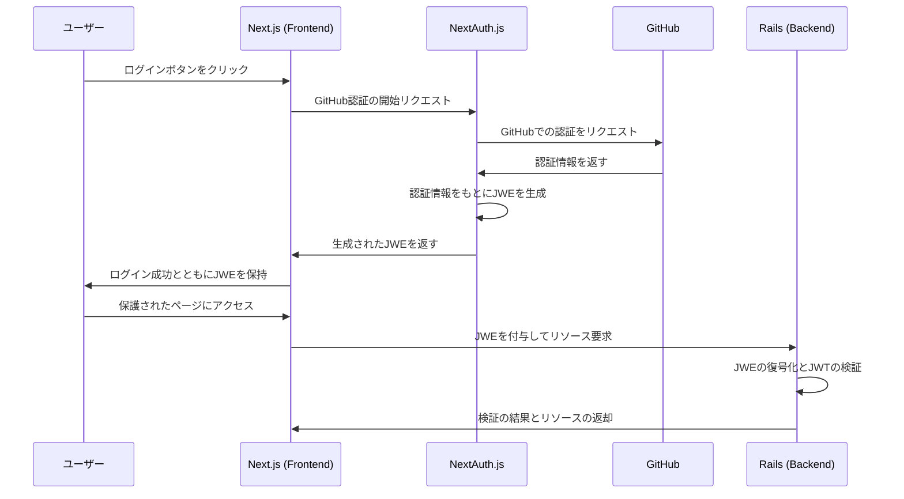

# 認証方法について
本サービスは、エンジニアのみに登録して頂けるように、ログインは、Github認証のみにしよう考えました。

Deviseのomniauthを使った認証、NextAuth.jsを使った認証　の２つで悩みました。
結論、NextAuth.jsの方がシンプルで効率的と思ったので、そちらを採用しました。

## devise-token-auth, omniauth-githubなどを使った認証
### フロー

## NextAuth.jsとGitHubでの認証、NextAuthで生成されたJWEを使用して、RailsでJWTを検証する認証:
### フロー

## 採用理由
deviseを採用すると、omniauth系のgemも複数必要で、内部的な処理を把握しづらいが、
NextAuth.jsはわかりやすい。
### ユーザーデータの柔軟性:
Deviseを使用しないため、必要に応じてユーザーデータの管理やカスタマイズが行いやすくなる。
### シームレスな統合:
NextAuth.jsはNext.jsのための認証ライブラリであり、Next.jsとの相性が非常に良い。これにより、シームレスな統合が可能となる。
### セキュリティ:
JWTは正しく実装されている場合、セキュアな認証方法となります。
### スケーラビリティ:
JWTはステートレスな認証方法であり、分散環境やマイクロサービスアーキテクチャにも適応しやすい。