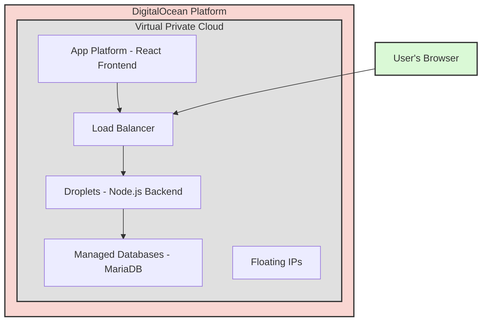

# MTG議事(2023/10/10)

## 自己紹介
- 胡本様、ECのことを幅広くやってきた。

## 要件定義
- 胡本様の要件定義を元に作成しています。
- 開発手法は、テスト駆動開発を実施します。
  - 仕様の理解度があがる。
- 胡本様とやり取りをするのは、土屋です。
  - 役割を分けて実装していきます。技術力がなければ、PM陣で巻き取ります。
- shopifyの審査について
  - 5日~7日かかる。これを月末にスタートできればOKです。
- アーキテクチャーについて
  - 図の通りで認識あっています
- 非機能要件について
  - shpify審査時に、レスポンスが遅いと審査が通らないことがあるので、それが通れば基本OK。
  - 非機能要件の記述は、shopifyの基準の噂？を算出したもの
- 共有するアカウント
  - 胡本様のgithub、デジタルオーシャン
  - 土屋のgithub、デジタルオーシャン
- shpifyのショップのコラボレーターを共有

- ソース管理は,土屋のgithub。フロントエンドのコード
- デジタルオーシャンは、契約は先方、作業は我々のアカウント

### フロントエンド (React):
DigitalOcean App Platform: ソースコードを自動的にビルド・デプロイするためのPaaSサービス。
### バックエンド (Node.js):
DigitalOcean Droplets: Node.jsアプリケーションをホストするための仮想サーバー。
### データベース (MariaDB):
DigitalOcean Managed Databases: メンテナンスやバックアップをDigitalOceanが行う、管理されたMariaDBのインスタンス。

