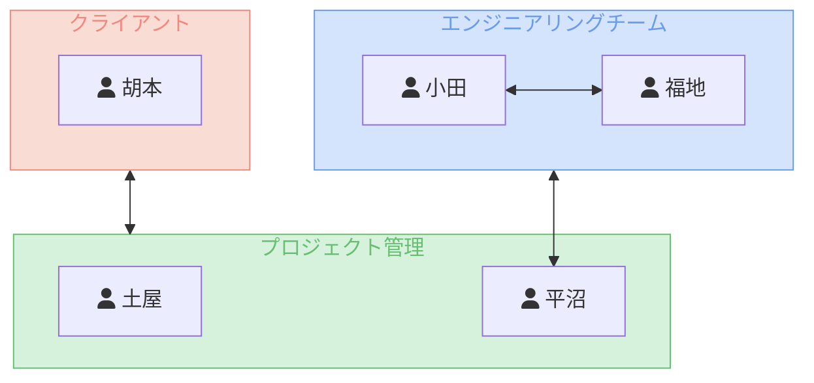
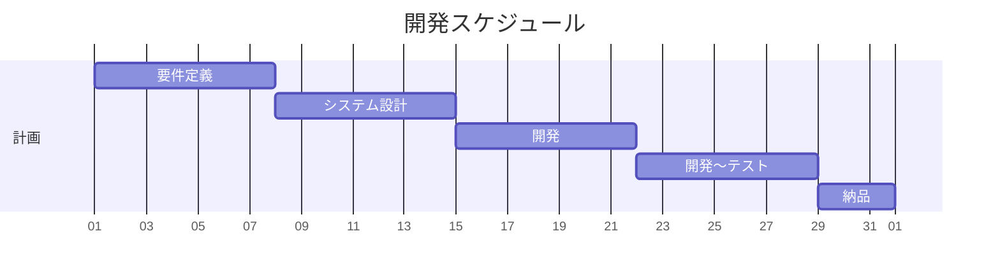
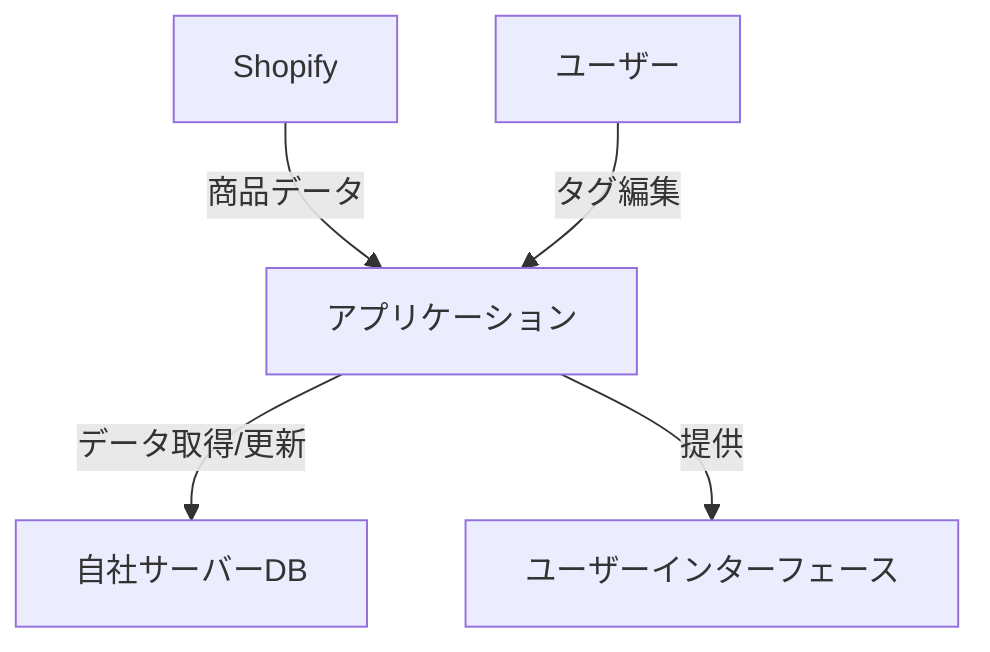
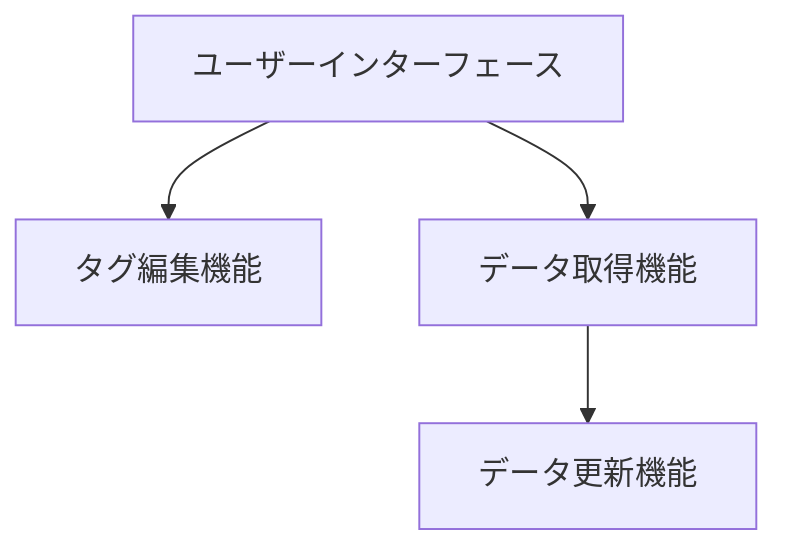
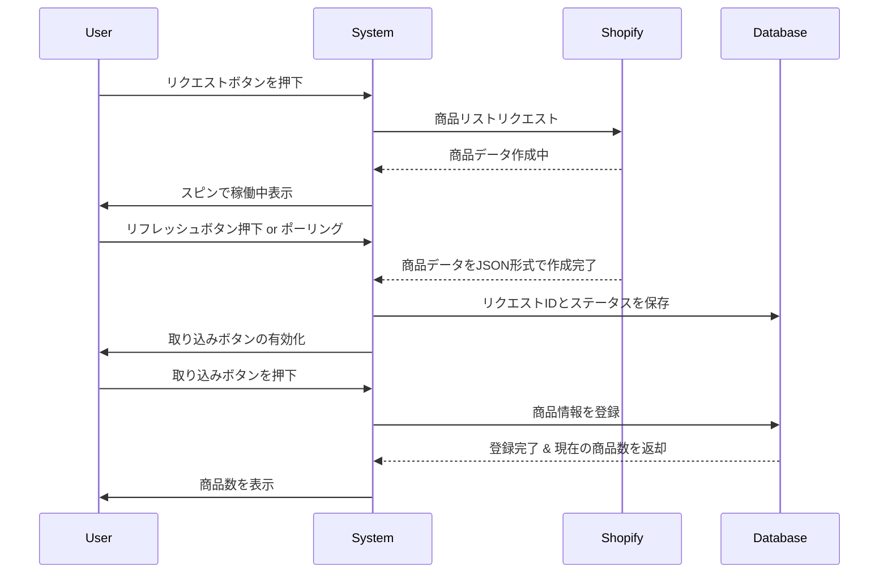
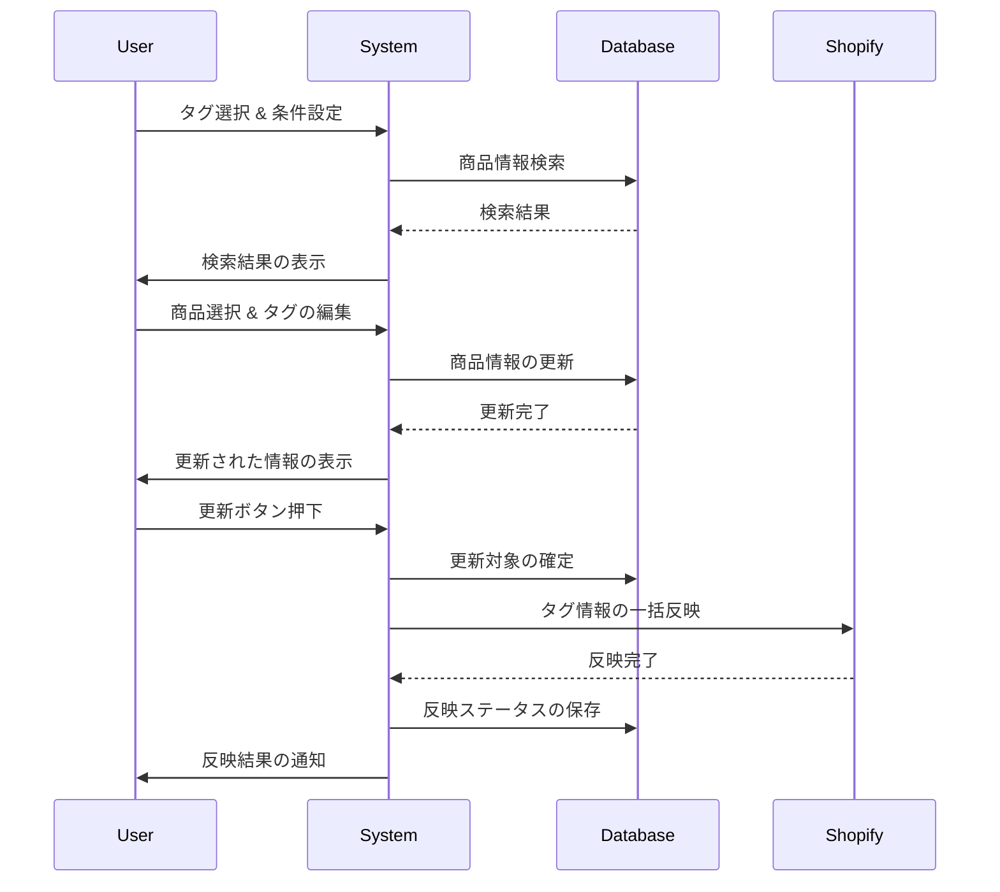

# 要件定義書

## 我々の動き方
### 開発手法
- テスト駆動開発を採用します。開発前に、テストケースを作成し、それらを満たすアプリケーションを開発することで、設計段階で認識合わせた通りの仕様に実装できます。
  - テスト駆動開発のメリット:
    - 仕様の理解度が上がる
    - 未来のリファクタリングや拡張が容易
    - 高いコード品質を維持

### メンバー
- PM
  - 土屋
  - 平沼
- エンジニア
  - 福地（バックエンド・インフラ）
  - 小田（フロントエンド）

## スケージュール
### 各工程とスケジュール
1. 10/1~10/7：要件定義
2. 10/8~10/14：システム設計、shopifyの仕様調査
3. 10/15~10/21：開発
4. 10/22~10/28：開発〜テスト
5. 10/29~10/31：動作検証・修正、納品

### スケジュール通り行かなかった時の対処方法
- リスク管理: プロジェクトの進捗に応じてリソースの調整や優先順位の見直しを行うことで、予期せぬ遅延に柔軟に対応します。
  - 週次ミーティングで進捗状況を確認
  - 外部要因や技術的な課題への対応
  - リソース不足時には、土屋と平沼で巻き取ります。

## システム要件
### 概要
- Shopifyでの商品管理は全てタグで管理されているため、商品のタグを一括で編集出来るアプリケーション
- Shopify登録の全商品のデータを取得し、情報の変更・更新、その後差分のみの一括更新を行う。

### アーキテクチャ 

### モジュール

### 機能要件
- 商品管理: Shopifyに登録されている全商品のデータを一括で取得し、タグ情報を編- 集。
データ更新: 編集された商品のタグ情報の差分のみを一括で更新。
- データベース設計: 提供されるデータベースの設計図に従い、必要なデータ構造を実現。

#### 商品リクエストからデータ取り込みまでのフロー

#### 商品情報の変更と一括反映

### 非機能要件
- 応答時間: 95%のリクエストが2秒以内に応答し、6秒を超えるリクエストは許容しない。
同時利用者数: アプリケーションの同時接続数は最大で100。
- 負荷テスト: 1時間にわたる1000リクエスト/秒の負荷を持続的に処理し、平均応答時間は3秒以内。
- データベースパフォーマンス: クエリの最大実行時間は1秒以内で、同時アクセス数は1000を超えない。
